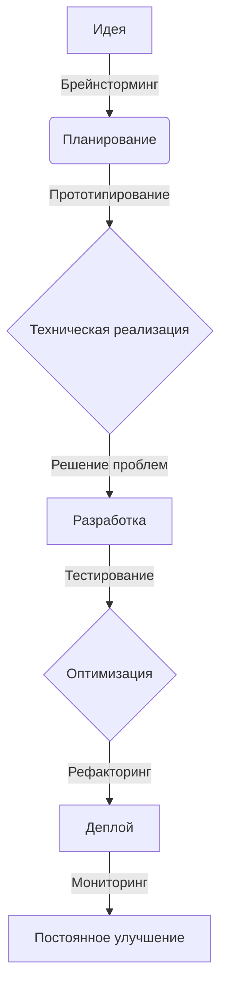

# 👋 Привет, я Тимур! 

  
  
  

  ## Добро пожаловать в мир моей разработки! 🚀

## 🌐 Обо мне

Я - **инженер-алхимик кода**, превращающий сложные технические вызовы в элегантные цифровые решения. Мой подход - это не просто написание кода, а создание цифровой магии!

### 💡 Мои суперспособности:
- 🧠 Молниеносный брейнсторминг
- 🔮 Превращение идей в работающий код
- 🚀 Скорость разработки выше среднего
- 🎨 Дизайнерское мышление программиста

## 🛠️ Технологический арсенал

  &nbsp;
  &nbsp;
  &nbsp;
  &nbsp;
  &nbsp;
  &nbsp;
  

## 🧩 Немного о workflow

## 🌟 Мой кодекс разработчика

- **Перфекционизм** в коде 💎
- **Инновации** превыше всего 🚀
- **Непрерывное обучение** - мой девиз 📚
- **Решение сложных задач** - моя стихия 🧠

## 📬 Давайте создавать будущее вместе!

🤝 Открыт к collaborate проектам

📧 timalololohka@gmail.com

**"Код - это поэзия функциональности"** 💻✨
